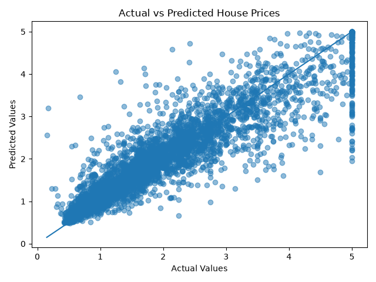
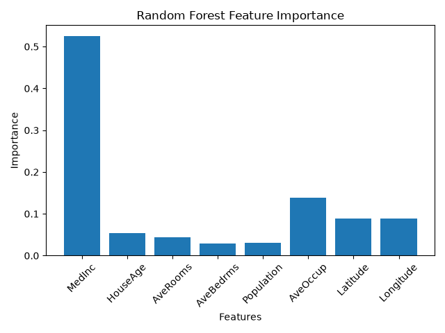
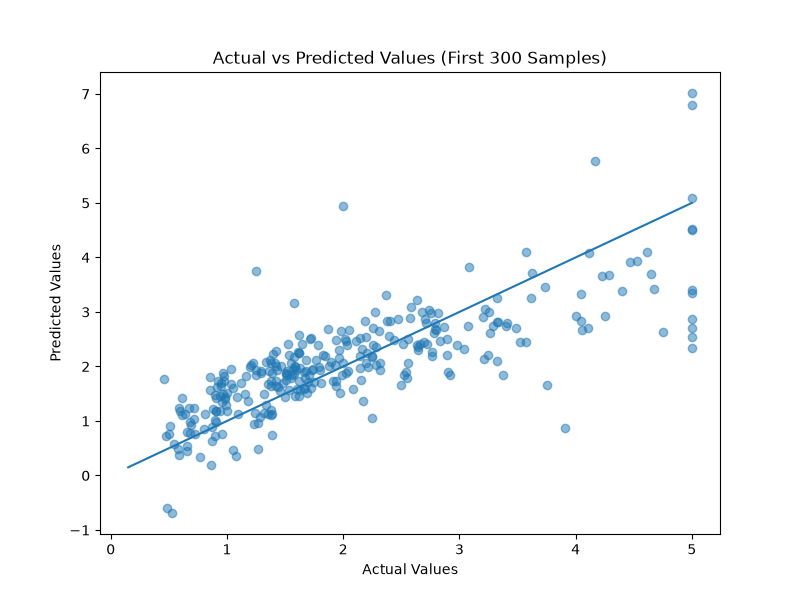
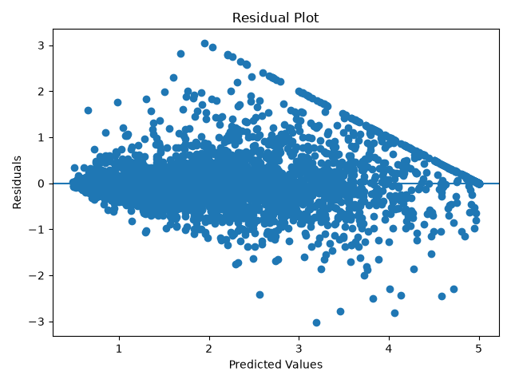

# California Housing Price Prediction

## Project Overview

This project uses Machine Learning to predict California house prices based on different housing-related features.

The project compares two regression models:

* Linear Regression
* Random Forest Regressor

The Random Forest model was trained and evaluated to determine its performance in predicting median house values.

## Dataset

The project uses the California Housing dataset provided by Scikit-learn.

The dataset contains several features related to California housing, including:

* Median Income
* House Age
* Average Number of Rooms
* Average Number of Bedrooms
* Population
* Average Occupancy
* Latitude
* Longitude

The target variable is:

* Median House Value (`MedHouseVal`)

## Project Workflow

1. Load the California Housing dataset.
2. Explore and inspect the dataset.
3. Check for missing values.
4. Separate features and the target variable.
5. Split the data into training and testing sets.
6. Train a Linear Regression model.
7. Evaluate the Linear Regression model.
8. Train a Random Forest Regressor.
9. Evaluate and compare model performance.
10. Analyze feature importance.
11. Visualize actual vs predicted values.
12. Analyze residuals.
13. Save the trained Random Forest model.
14. Load the saved model and make predictions.

## Models Used

### Linear Regression

Linear Regression was used as a baseline model for predicting house prices.

### Random Forest Regressor

A Random Forest Regressor was trained using 100 decision trees.

The model was configured with:

* `n_estimators = 100`
* `random_state = 42`
* `n_jobs = -1`

## Evaluation Metrics

The models achieved the following results on the test dataset:

| Model | MAE | RMSE | R² Score |
|---|---:|---:|---:|
| Linear Regression | 0.533 | 0.746 | 0.576 |
| Random Forest | 0.328 | 0.506 | 0.805 |

The models were evaluated using:

* Mean Absolute Error (MAE)
* Mean Squared Error (MSE)
* Root Mean Squared Error (RMSE)
* R² Score

The Random Forest Regressor performed significantly better than the Linear Regression baseline, achieving an R² score of approximately 0.805.

## Feature Importance

The Random Forest model was also used to identify which features have the greatest influence on house price predictions.

## Visualizations

The project includes:

* Actual vs Predicted Values plot
* Random Forest Feature Importance plot
* Residual Plot

### Linear Regression — Actual vs Predicted



### Random Forest — Feature Importance



### Random Forest — Actual vs Predicted



### Random Forest — Residual Plot



## How to Run

1. Clone this repository.
2. Install the required Python packages:

```bash
pip install -r requirements.txt
## Technologies Used

* Python
* Pandas
* NumPy
* Scikit-learn
* Matplotlib
* Joblib

## Project Structure

```text
California-Housing-Price-Prediction/
│
├── notebooks/
├── models/
│   └── random_forest_model.pkl
│
├── train_model.py
└── README.md
```
Run the training script:
python train_model.py

This will train the Random Forest model and generate the saved model file locally in the models folder.
 
## Saved Model

The trained Random Forest model is generated locally using Joblib.

The model file is not included in this repository because it is larger than GitHub's standard file size limit.

After running train_model.py, the model will be available at:

models/random_forest_model.pkl

## Future Improvements

Possible future improvements include:

* Hyperparameter tuning
* Comparing additional machine learning models
* Adding cross-validation
* Creating a web application for house price prediction
* Deploying the trained model
